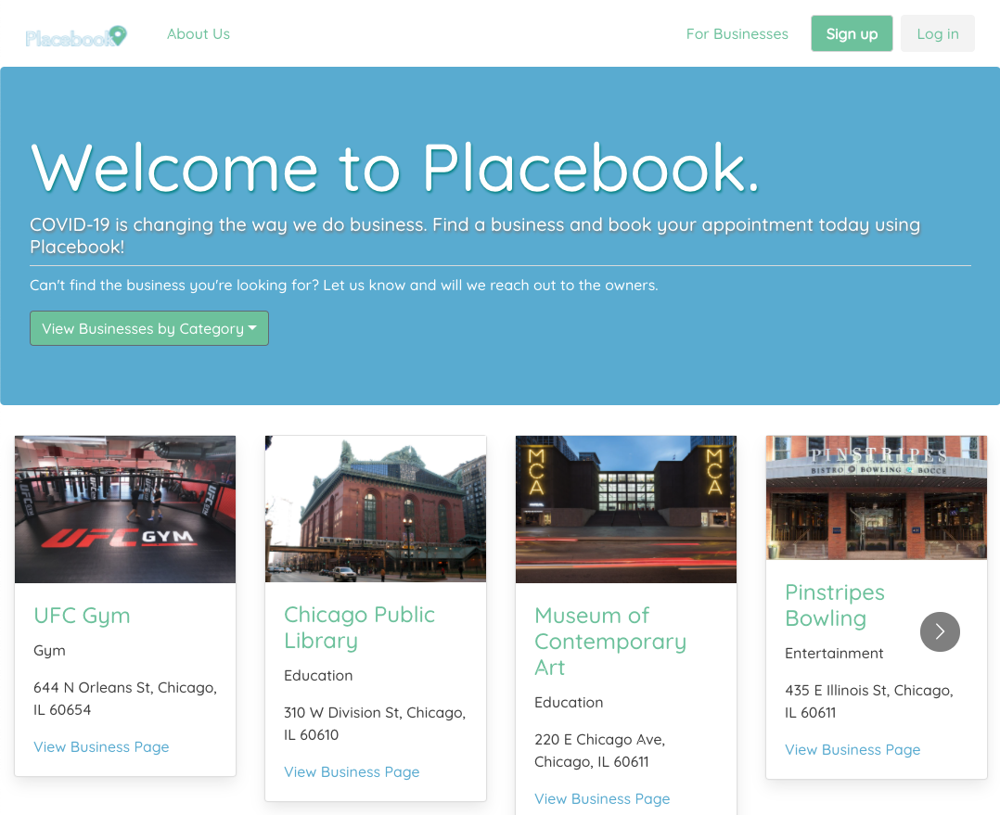
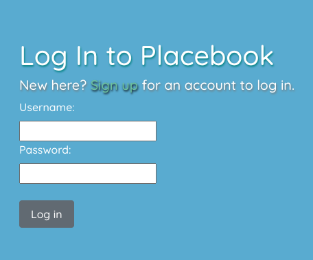
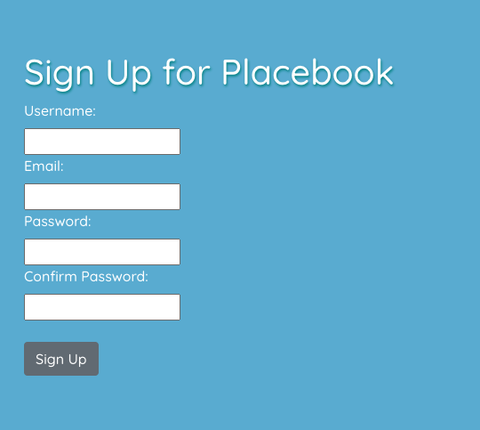
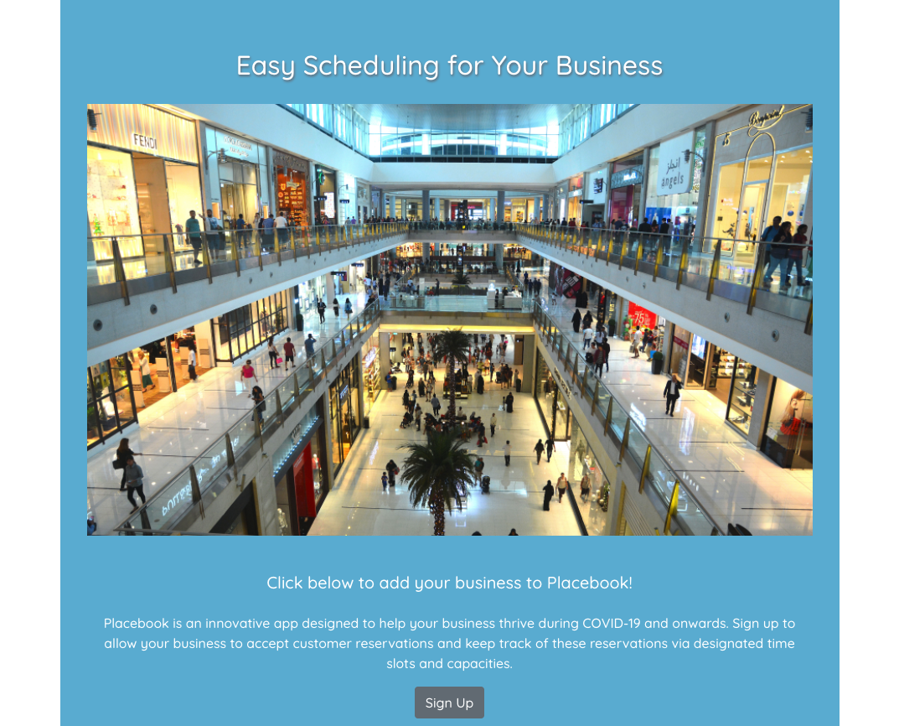
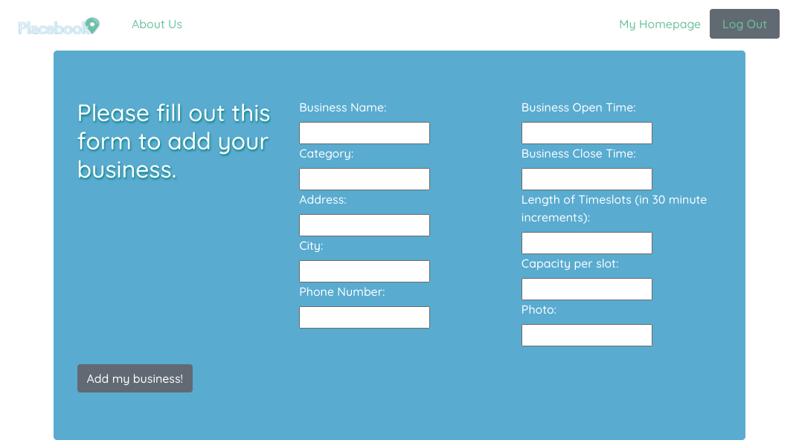
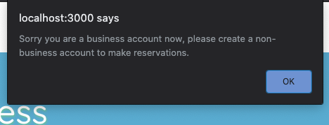
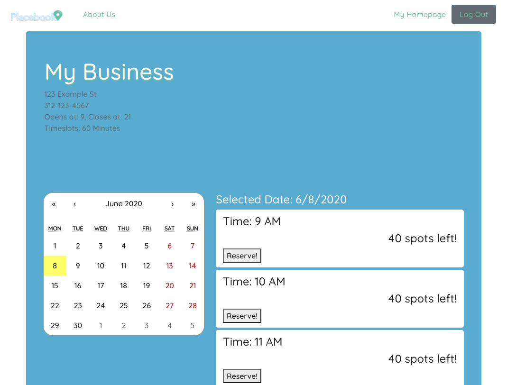

# Placebook
### Peter Blank, Phil Hurst, Emily Resch
_________________________

_________________________

### Table of Contents
- [What We Used](###what-we-used)
- [About Placebook](###about-placebook)
- [How It Works](###how-it-works)
- [Future Davelopment](###future-development-for-placebook)
- [Authors](###authors)
_________________________

### What We Used
- React and Reactstrap
- NodeJS
- Express
- MDB React
- Bulma CSS
- Npm Passport
- MongoDB
- Google Fonts
- Animate On Scroll Library

### About Placebook
Placebook is a website that can be used by business owners and individual users alike. The ongoing pandemic has affected businesses in ways that were difficult to anticipate, but now that businesses are slowly being allowed to open, we wanted to create an app that would help them to create a reservation system for their physical locations. We were inspired by the functionality of websites such as OpenTable, which have business and individual login systems.
Businesses can add themselves to Placebook by filling out a form to determine their opening/closing times, timeslot length for customers, and customer capacity. Placebook supports any business looking for a reservation system, from gyms to beauty salons to museums. 

### How It Works

Visitors to our website are presented with a Placebook welcome page. This page displays a Navbar, a dropdown menu, and individual business cards. 

>>  

If an individual is new to our website, they have the ability to browse our Welcome page, our About page and the individual business pages, however they will not be permitted to reserve a timeslot at any business until they have created a Placebook account.

>>  
>> 

For business owners, There is a "For Businesses" option in the Navbar that directs users to a business signup page. Business owners, once they have also created a Placebook account, can fill out this form to add their business to the website. 

>> 
>> 

Business accounts cannot make reservations at other businesses, so they will need to make a regular user account to do so.

>> 

Individual users have access to a Homepage that allows them to view and cancel their upcoming reservations. Business Homepage's allow businesses to view any reservations that users have made to visit their location.

>> 

### Future Development For Placebook

We believe that Placebook has the ability to be used nation-wide, or bigger! 
There are some things that we would love to add in the future to make this possible:
- React Native app capabilites (PWA)
- Shaded time slots to easily determine which timelslots are in the past or future
- Modals to confirm chosen timeslots

### Authors
[Peter Blank]("https://github.com/blapete")
---

[Emily Resch]("https://github.com/emilyresch")
---

[Phil Hurst]("https://github.com/pyhurst")
---

